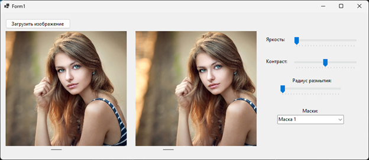
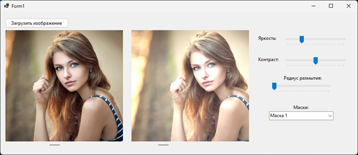
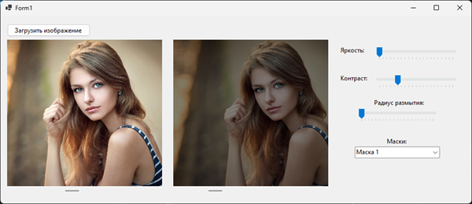
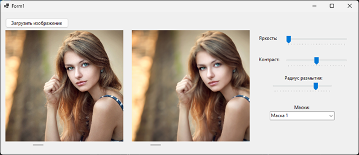
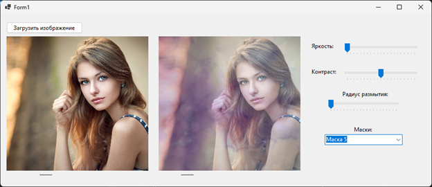
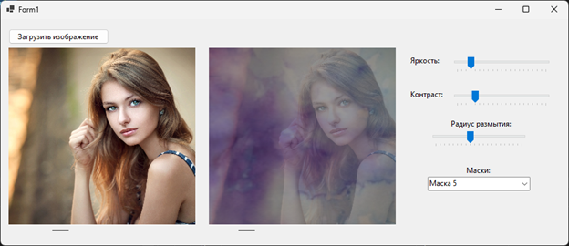

# Цель работы: 
Изучение способов комбинации простейших функций для реализации сложного фильтра.

# Основные задачи:
Необходимо разработать приложение Windows Forms способное осуществлять: 
1.	Обнаружение и распознание текста. 
2.	Обнаружение лиц в видео потоке.

# Задание:
Необходимо разработать приложение Windows Forms выполняющее обработку изображение по алгоритму соответствующему вашему варианту. Пользователь должен иметь возможность загрузки своего изображения, а также настройки параметров фильтра.
Рекомендуется реализовать в приложении два окна для вывода изображения – одно для изначального изображения, второе для обработанного.

«Акварельный фильтр»:
1.	Коррекция контраста и яркости изображения. У пользователя должна быть возможность настройки данных параметров в интерфейсе приложения.
2.	Размытие изображения. Для выполнения этого пункта предлагается использование медианного фильтра.
3.	Сложение изображения с «маской». Маска должна быть уже загруженной в самом приложении.

# Результат:
1. Изменение контраста и яркости
2. Применение медианного размытия
3. Наложение масок на фото

## Обнаружение и распознание текста + загрузка фото:
Загружено фото

  

Повышена яркость

  

Понижен контраст

  

Размытие

  

Маска

  

Все фильтры

  

